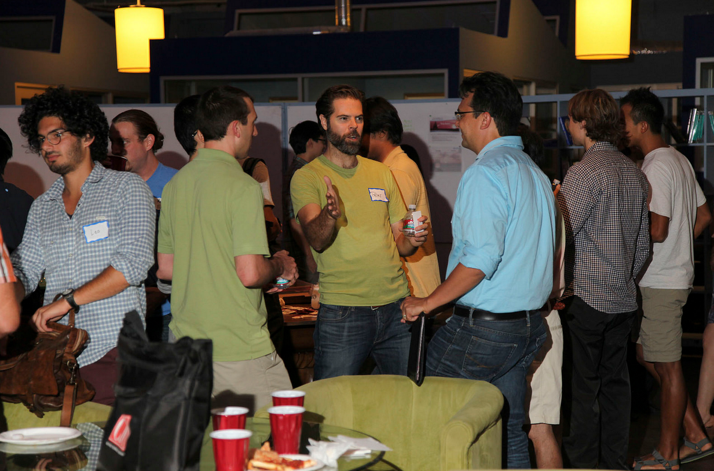
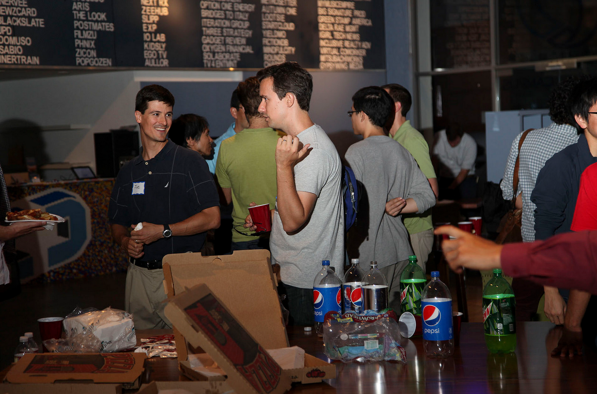
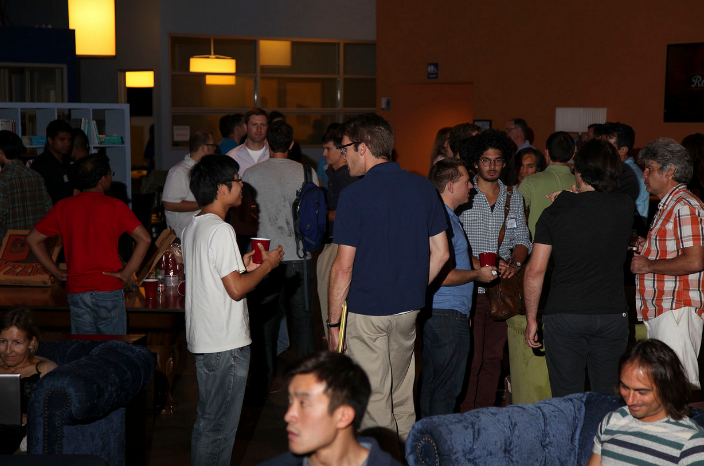
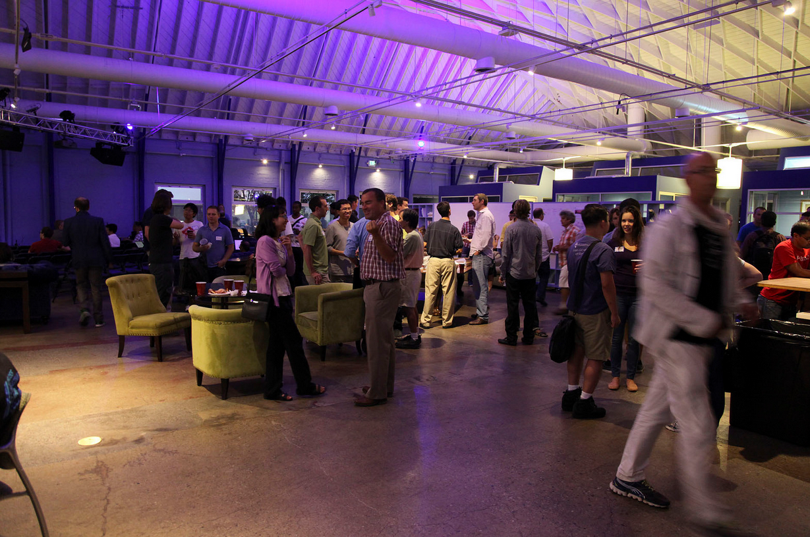
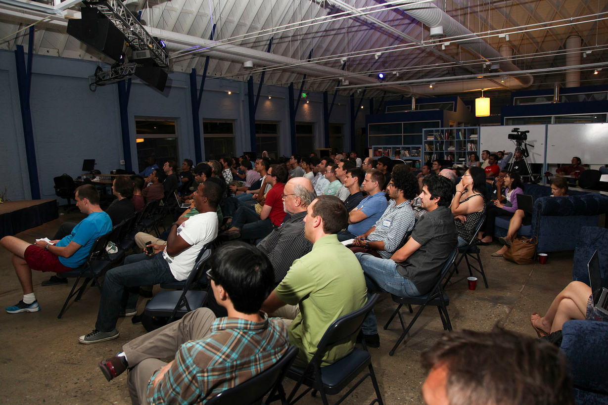

*(Posting the slides and video recording from this event is long overdue - our apologies for the delay.)*

At the September LA Data Science/Machine Learning meetup we had [IRIS.TV](http://iris.tv/)'s Chief Data Scientist [Tom Sullivan](https://www.linkedin.com/pub/thomas-j-sullivan-ph-d/27/744/39a) and VP of Engineering [Joel Spitalnik](https://www.linkedin.com/pub/joel-spitalnik/55/220/978) presenting.

IRIS.TV is a video recommendation engine, and in their excellent talk Tom & Joel shared with us their approach to personalization and how they use machine learning to achieve their goals. They also shared the architecture of their systems, including how data is flowing between the various parts (i.e. the ETL pipeline). One thing that popped up as a question and I found interesting is that the usage of R and Python in their company is split 50-50. In fact, while Tom is using mainly R, Joel is using mainly Python. While this is perhaps unusual at a relatively small startup, our [survey on software tools used for data science](/data-science-toolbox-survey-results-surprise-r-and-python-win/) revealed that most data scientists in LA (at least those attending the meetups) are using R or Python, with a roughly equal split/small advantage for R. It just happens that for obvious reasons (such as network effects) that one tool dominates in most companies.

The talk touched on several other issues, and you can view the slides here:



I'd like to thank [Cross Campus](http://www.crosscamp.us/) for hosting and [Factual](http://www.factual.com/) for sponsoring and providing pizza. (I would also like to personally thank [Aaron Crow](http://www.linkedin.com/in/aaroncrow) for not only being a great software engineer and organizer of several meetups, but also for making sure we have great pizza).

Finally, below are a few pictures from this meetup (Thanks, Jeff Weakley!) and more meetup pics are available in [this flickr album](https://secure.flickr.com/photos/data-science-la/sets/72157647281293850/). If you are interested, there are even more pictures from our previous meetups available in [our flickr account here](https://secure.flickr.com/photos/data-science-la/sets/).

