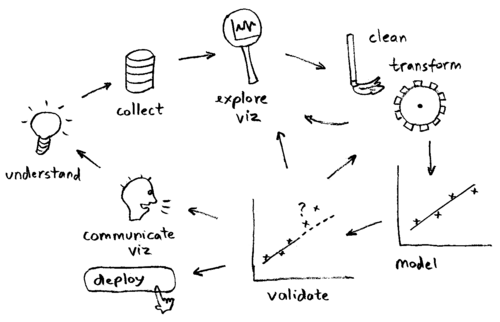

This is a re-publication of a [blog post](http://data-science-la.tumblr.com/post/82349580838/data-science-toolbox-survey) from a [blog](http://data-science-la.tumblr.com/) I created not long before we got the idea to start [DataScience.LA](/), and in many aspects it is the genesis of DSLA (the blog's name, the people getting together - thanks Eduardo, Amelia and Leigh). It was also the spark that lead to the creation of the [Python Data Science LA meetup](/announcing-the-new-pydata-la-meetup-group/).

At a previous [LA Data Science/Machine Learning meetup](http://www.meetup.com/LA-Machine-Learning/events/165175132/) we did an informal survey (using a quick show of hands and a very approximate count) of the software tools used for data analysis by those in the audience. With about 200 people in attendance and about 60% saying they are data scientists or perform a similar job, I believe the results below are more representative and less biased than our previous attempts via meetup polls (where relatively few responded) or even more formal surveys others have attempted (e.g. my friends at [KDnuggets](http://www.kdnuggets.com/2014/06/kdnuggets-annual-software-poll-rapidminer-continues-lead.html) or [Rexer Analytics](http://www.rexeranalytics.com/Data-Miner-Survey-Results-2013.html)). I know, there is a likely bias in our results as well, towards open source tools, maybe our meetups are just too cool for all those SAS users out there (I kid, I kid.)

Considering the various parts of the process of analyzing data,

we surveyed the audience for tools used in:

1. data munging (“explore”, “clean” and “transform” above) – both exploratory data analysis (EDA) and operational ETL,
2. visualization – both exploratory and presentational,
3. machine learning/modeling.

We started with tools that I (Szilard) thought must be the most popular, but we also asked what other tools people are using, so we didn’t miss any hidden gems.

When we asked about data munging we found that about 60% are using R in some part of their data science process, 50% were using Python, 40% SQL, 30% Hadoop (mostly Hive), 20% Unix shell. Only 10% acknowledged using Excel. Other tools used by some of our attending data scientists included Perl, Matlab, SAS – Pig, Impala, Shark within Hadoop. Clojure, Scalding, Elasticsearch made an appearance with just one user each.

For visualization, about 40% were using R, 30% using Python, 10% Tableau, 10% building custom in Javascript (although we admit we did not ask which libraries). Just a few people are using Excel or Matlab, and there was a Splunk user out there too.

When it came to machine learning, only 30% of the audience raised their hands saying they used R, with about 30% using Python. There were quite a few tools mentioned with 2-3 hands apiece, such as Vowpal Wabbit, SAS, SPSS, Matlab, Mahout. In the minority were users of Spark MLlib, Graphlab, Shogun, and Weka.

I feel that this quick and dirty poll gives us a starting picture of a typical data scientist's toolbox across a few of our major tasks. With a more formal survey we can get into further detail within our rough categories, such as breaking down by usage for EDA vs ETL or separating into groups those who use various R/Python packages. As you could imagine, we’re thinking of doing this in the near future - stay tuned.

I’d like to thank Eduardo Arino de la Rubia for helping with the survey. Feel free to post your personal tools of choice in the comments below (especially if it’s not mentioned above)!
