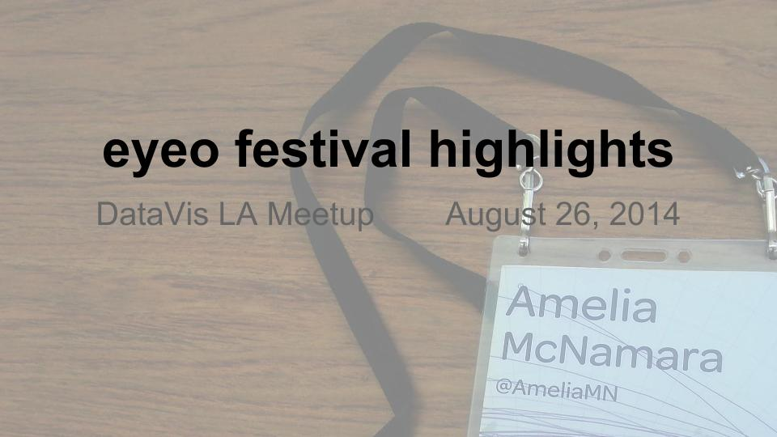
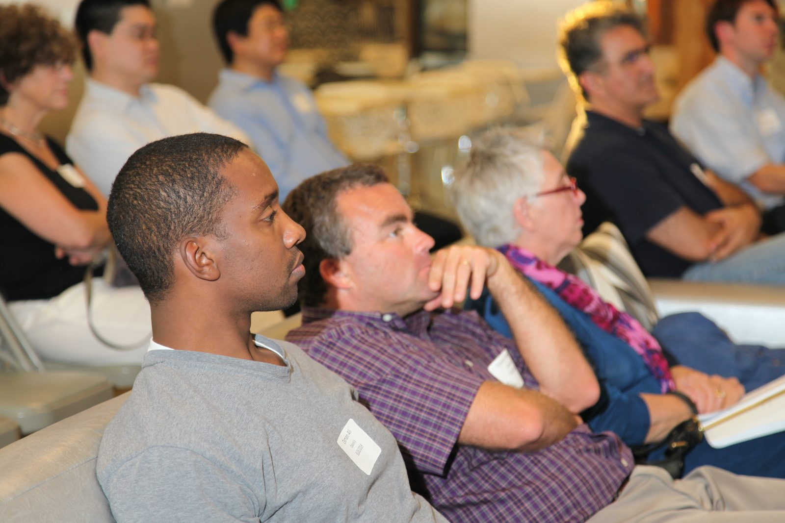
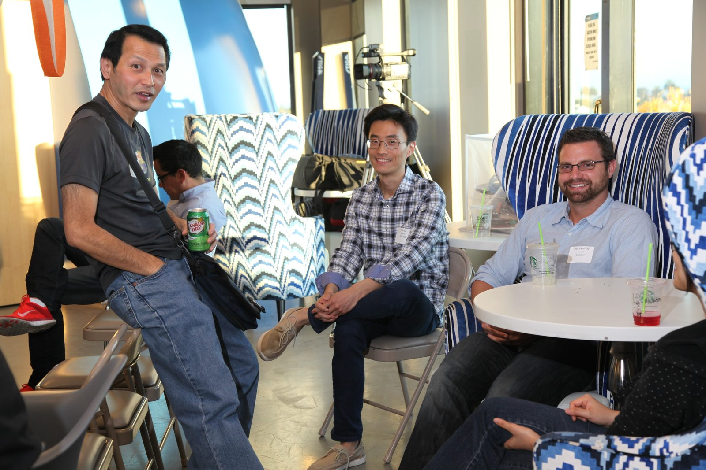
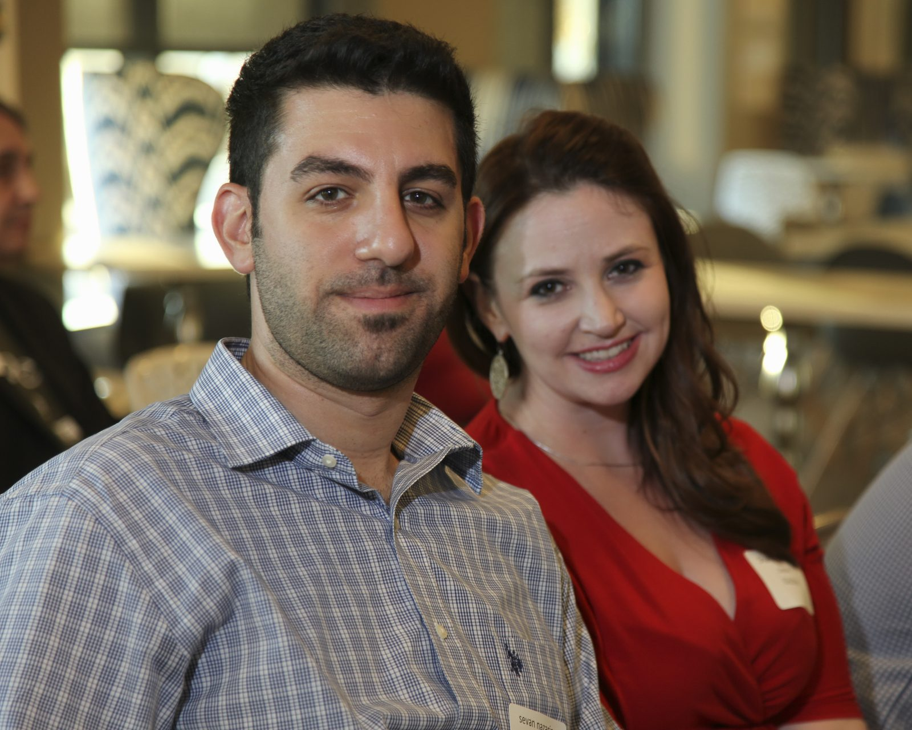

Last week, I got the opportunity to share the highlights from the [eyeo festival](http://eyeofestival.com) at the DataVis LA meetup. The eyeo festival is a yearly event held in Minneapolis that draws together artists, technologists, designers, and many more people who work with art and computers. As I said in the meetup description, a lot of the things that caught my eye this year could be described better by the term "art" than straight "data visualization," although there's usually both at the festival. I also really liked that this year's festival emphasized the history of computer art and data visualization. By bringing in Frieder Nake, Lillian Schwartz, and Roman Verostko, the organizers grounded us in the history that started in the 1960s.

For my highlights, I called out:

[Frieder Nake](https://twitter.com/CarlCanary) -- Would You Do It?

[Nicholas Felton](https://twitter.com/feltron) -- Too Big to Fail

[Adam Harvey](https://twitter.com/adamhrv) -- The Electromagnetic Spectrum of Counter/Surveillance

Lillian Schwartz -- Computer Films: 1970-present

[Cod.Act (André et Michel Décosterd)](http://codact.ch/) -- Pendulum Choir

I wasn't expecting to have time to talk about anything else at the meetup, but I got through all that relatively quickly, so I was able to finish up with a few more highlights I had stashed at the back of my slide deck:

[Mike Bostock](https://twitter.com/mbostock) -- Visualizing Algorithms

[Kate Crawford](https://twitter.com/katecrawford) -- Big Data Anxieties

[Kim Rees](https://twitter.com/krees) -- The Future of Data

[Roman Verostko](https://twitter.com/penplot) -- Algorithmic Leverage

[Santiago Ortiz](https://twitter.com/moebio) -- Six Months

[Robert Hodgin](https://twitter.com/flight404) -- Default Title

If you want to see more about the highlights I called out, see my slides (which are full of all kinds of goodies -- photos, tweets, speaker notes, and links): \
We were lucky to have [Jeff Weakley](/team/#jeff_weakley) in attendance at the meetup, and he recorded the talk and put it on [YouTube](https://www.youtube.com/watch?v=J838Uoc1Wac&list=UUJ4D3tL-iEWyJJDXJAsd9Mw) (same video as embedded above). He also took a bunch of gorgeous photos of the crowd, see the few below, or the [entire set on Flickr](https://secure.flickr.com/photos/data-science-la/sets/72157646908437481/).   \
For these and many more photos (including some great headshots of people who attended the meetup) check out the [Flickr set](https://secure.flickr.com/photos/data-science-la/sets/72157646908437481/). *(If you're jonesing for a gorgeous photo of yourself, Jeff comes to the data science LA meetups pretty frequently. While I can't promise he'll always be in attendance, there's a pretty high probability.)*
