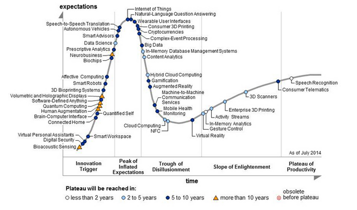

> “At one point, the only source for daily R news was David Smith’s blog.” -- [Szilard Pafka](/team/#szilard)

David Smith is an integral part of the R community. His background in computational statistics goes back to the early 90s . David has worked at [Revolution R](http://www.revolutionanalytics.com/), one of the leading R companies, for nearly a decade. His name has been included in lists such as:

- Top 20 influencers in big data
- 30 most influencial Data Scientists on Twitter
- #3 Best Big Data Twitter account
- Top Big Data Executives and Experts to Follow on Twitter

David Smith is a powerhouse of connections, information, and knowledge not only about the R community but also the Data Ecosystem as a whole. After having the privilege of a lovely conversation regarding the state of our industry at useR! 2014, however, I can tell you that above all things, David Smith cares about the happiness and well-being of the community he has seen flourish around him in recent years.

In this wide-ranging interview, David and I talk about how he became involved in mathematical software, his transition from a statistician to his current role as Chief Community Officer at Revolution Analytics, and what that role entails.

#### Video Breakdown

Please click [here](http://www.youtube.com/watch?v=Is1Ej0Vj0Mw) to see the video directly on youtube. Or if you prefer, subscribe to our [podcast](/announcing-the-dsla-podcast/) to get the audio!

##### Birth of the Revolution Blog

We began this interview by discussing his blog for [Revolution Analytics](http://blog.revolutionanalytics.com/), and how it has grown into an amazing community resource. For a long time, this blog has been one of the most actively updated, thoughtfully curated centerpieces of R community discussion on the internet.



##### Journey of R from Academia to Industry

We then recounted the long journey that R has traveled from a niche language used primarily in the academy by a select group of computational statisticians to the wide appeal it has currently found in industry. We talk about how originally insurance and pharma were the only two sectors interested in data, yet since the birth of Google's business models and data-driven decision making most future looking businesses now see their futures intrinsically tied to their company's ability to understand the relevance of the signals in their own data.



##### Big Data, Hype and Reality

There is probably no term more overused in recent years than Big Data. A recent series of articles highlight how the "Big Data" hype cycle is now entering the "[trough of disillusionment](http://www.forbes.com/sites/gilpress/2014/08/18/its-official-the-internet-of-things-takes-over-big-data-as-the-most-hyped-technology/)."

Is this trend our reality, though? Companies have worked with large data sets for a very long time, however these explorations were very regimented and controlled rather than the comprehensive data science processes known today. What has changed is the ability for individual analyst to manage large scale data-sets in an ad-hoc format and store their data at a much lower cost. Since the birth of [Hadoop](http://hadoop.apache.org/), the marginal cost of storage has decreased such that what was previously only available to companies at the highest end is now available to everyone.



##### Data Science is Sexy!

This takes us to the loaded term "Data Scientist". Whether you are a fan of the term or not (and David is), the fact is that a lot of folks continue to call "Data Scientist" the [sexiest job of the 21st century](http://hbr.org/2012/10/data-scientist-the-sexiest-job-of-the-21st-century/ar/1). Even at the same time that people are wondering if it's already [time to kill the "Data Scientist" title](http://blogs.wsj.com/cio/2014/04/30/its-already-time-to-kill-the-data-scientist-title/). In the interview we discuss the importance of the term Data Scientist as a way of conveying the multidisciplinary nature of the job, even if this job is really what statisticians have been doing all along.



##### The Many Sub-Communities in R

R is a language for programming with data, but you'd be hard pressed to find an industry that isn't alive with data in 2014. In this section of the interview, we discuss the infrastructure that the R community has gotten right, from CRAN to the cross-pollination of ideas across industries and from biostatistics to marketing. We outline how statistical models used in one field can find new life in completely unrelated fields, both from the standpoint of simple model application and how ideas spur new and exciting innovations.



##### R as a Thought Leader in Reproducibility

There are plenty of horror stories about how a researcher's inability to reproduce scientific findings have hurt the science field as a whole. Some studies show that as [little as 10%](http://www.jove.com/blog/2012/05/03/studies-show-only-10-of-published-science-articles-are-reproducible-what-is-happening) of published studies in scientific journals are truly reproducible. While this problem has plagued science since the birth of the scientific process, the past few years have seen the problem brought to the forefront. From the [Economist's](http://www.economist.com/news/briefing/21588057-scientists-think-science-self-correcting-alarming-degree-it-not-trouble) stance that the problem may lie in the current funding model to the journal Nature focusing an [entire special issue](http://www.nature.com/nature/focus/reproducibility/) on the topic, it's clear the problem has finally begun to draw the attention it deserves. From the non-reproducibility of [syphillis bacteria](http://en.wikipedia.org/wiki/Hideyo_Noguchi) to [cold fusion](http://en.wikipedia.org/wiki/Cold_fusion#Fleischmann.E2.80.93Pons_experiment), this problem with reproducibility won't simply go away.



In this section, David discusses what got him interested in the topic, a presentation at the BioConductor conference regarding a cancer study that was non-reproducible. The tooling wasn't available for peer review, the code wasn't available, the data wasn't available, nothing was available. R has a number of interesting projects trying to address this reproducibility issue, from [Yihui's knitR](http://yihui.name/knitr/) to Revolution's own Reproducible R Toolkit ([RRT](https://github.com/RevolutionAnalytics/RRT)) and [many others](http://rstudio.github.io/packrat/).

##### R's Coolest Features

David's response to what makes R special is particularly interesting when taken as part of the larger theme at this year's useR! 2014 conference. In the keynote, one of the biggest messages from John Chambers was R's intention as an interface. An interface works in both directions, from the user down into the computer as we generally conceptualize, but it is also important to remember that the interface is also from the computer up to the user. David's focus upon the features that make it possible for R users to truly excel definitely showcase his emphasis on the *users* of R and his role as *their* advocate.



##### Advice to new R Programmers

While David admits that these days he doesn't spend a lot of time programming in R, he does spend a lot of time writing the Revolution R blog. His advice to programmers is in line with his own progression: R programmers should write, blog, and use those two avenues as a scaffolding to grow their own learning over time.



##### How to Build a Community

By David's estimate, there are more than 2 million R users today. When you are considering such a large number of people, the underlying need for a community is definitely there. The question then becomes how do you provide the necessary scaffolding for a community to grow in a fashion that will be welcoming to new members? How are you supportive of members that have been there a long time? How do you provide a strong identity to the outside world? These are in addition to defining what being a community member means and sustaining the ecosystem over time.



David Smith expresses his desire for us each to have fantastic job opportunities, have fun during the process of data science, and really feel like what we are doing is valuable to the world around us. This is clearly what motivates him every day, and the R community lucky to have someone like him in a visible position, putting himself out there as an example of approachability, contribution, and leadership.
