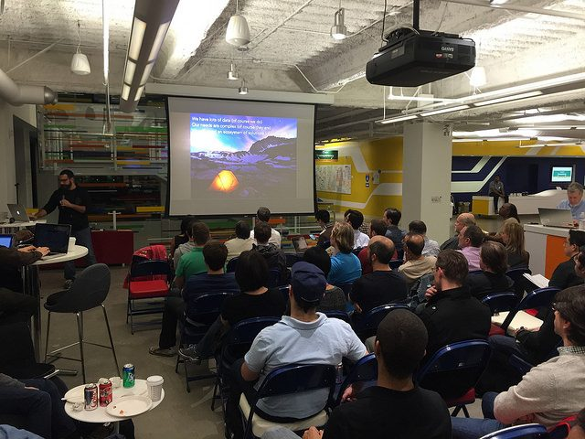
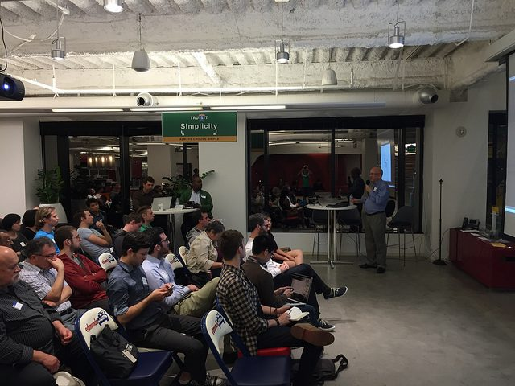
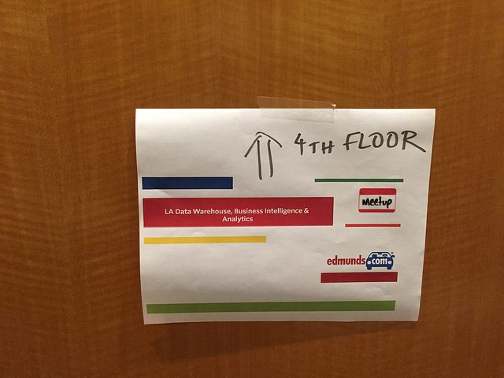
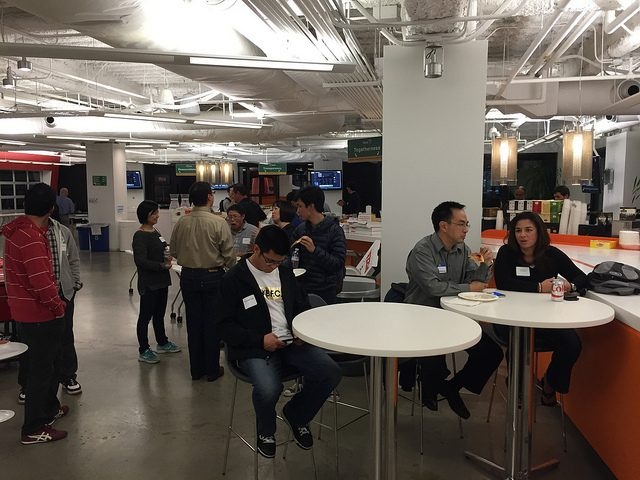
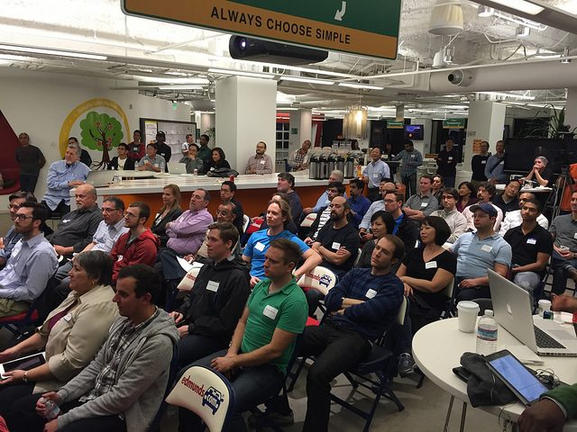

The [LA Data Warehouse, Business Analytics and Analytics meetup](http://www.meetup.com/LA-Data-Warehouse-Business-Intelligence-Analytics/) had a fantastic first event with a great audience (full house), an awesome host (thanks [Edmunds](http://www.edmunds.com/): [Punnoose](https://www.linkedin.com/in/punnooseisaac) for taking the lead and the Team onsite and helping) and a great mix of 3 talks overviewing the field.

Despite the hype of data science and big data, a majority of the business value produced by data still happens in this more traditional DW/BI setting. On the other hand, DW/BI/Analytics is getting more fancy: columnar/MPP databases, modern HTML5 web-based BI/visualization software, more reliance on big data systems such as Hadoop/Spark, powerful GUI products for predictive analytics etc.

Our first speaker, [Szilard Pafka](https://www.linkedin.com/in/szilard) spoke about why he and his DataScience.LA partner Eduardo started this new meetup group and what can be expected ahead (format, topics to be covered). His slides are here:



and video here:



Second,  [Eduardo Arino de la Rubia](https://www.linkedin.com/in/earino) discussed a project at his employer where they attempted to find the big data strategy that worked for their reasonably large, but very slow moving data. His findings were summarized on these slides:



while the video of his talk is here:



Finally, [Eric Klusman](https://www.linkedin.com/pub/eric-klusman/0/870/3b2) made an overview of the major platforms for business intelligence and analytics, slide here:



and video here:



In summary it was an awesome start for a new meetup group and we hope to see you at our next event!

Your Co-Organizers,\
Szilard & Eduardo

P.S. - Here are some pictures from the event:

    

with some more pictures on [our flickr account here](https://secure.flickr.com/photos/data-science-la/sets/72157650732312581/).
