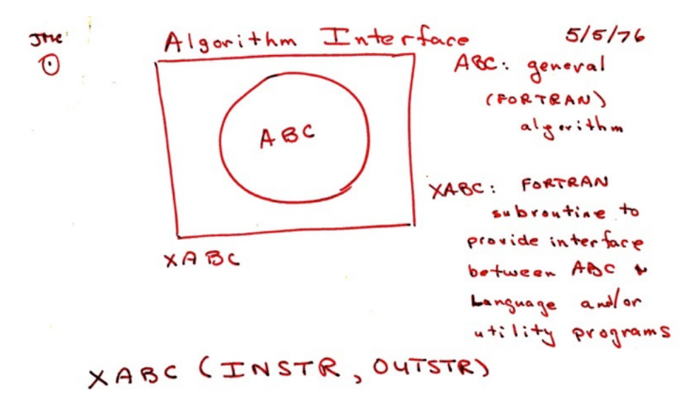

At useR! 2014, [John Chambers](http://statweb.stanford.edu/~jmc4/vitae.html) was generous enough to provide us with insight into the very early stages of user-centric interactive data exploration. He explains, step by step, how his insight to provide an interface into algorithms, putting the user first has placed us on the fruitful path which analysts, statisticians, and data scientists enjoy to this day. In his talk, John Chambers also does a fantastic job of highlighting a number of active projects, new and vibrant in the R ecosystem, which are helping to continue this legacy of "a software interface into the best algorithms." The future is bright, and new and dynamic ideas are building off these thoughtful, well measured, solid foundations of the past.

To understand why this past is so important, I'd like to provide a brief view of the historical context that underpins these breakthroughs. In 1976, John Chambers was concerned with making software supported interactive numerical analysis a reality. Let’s talk about what other advances were happening in 1976 in the field of software and computing:

- In January of 1976, the very first [Cray-1](http://en.wikipedia.org/wiki/Cray-1) (a commercially available supercomputer), developed by Cray Research, is available.
- In April of 1976, Steve Jobs and Steve Wozniak decide to form a little company called Apple Computer.
- In November of 1976, [some kid](http://en.wikipedia.org/wiki/Bill_Gates) in New Mexico decides to start a company with the audacious goal of making money from selling software, he picks the name MicroSoft.
- In December of 1976, the very first word processor for personal computers is released, [Electric Pencil](http://en.wikipedia.org/wiki/Electric_Pencil).

Suffice it to say, 1976 was clearly a very busy year, and at the very earliest dawn of the transition from a priesthood of centralized computing to a democratized land of individualized computing. At the crest of that wave, on May 5th, 1976, John Chambers sketched out an idea in a laboratory at the famed Murray Hill office of [Bell Labs](http://en.wikipedia.org/wiki/Bell_Labs).

Stated simply, there should be an interface to the very best numerical algorithms available. Those algorithms should be implemented in the way is most natural for them, in whatever language is best for them (usually Fortran), but the user should be freed from the constraints of working at such a low level. The user should be able to think at a higher level, manipulate at a higher level, and be productive at a higher level.

Thus was born the [S programming environment](http://en.wikipedia.org/wiki/S_(programming_language)), the predecessor to R, and in no small part to almost every user-centric scientific software tool today. For this achievement, John Chambers received the coveted ACM Software System Award in 1998, for the feat of “forever altering the way people analyze, visualize, and manipulate data.”
