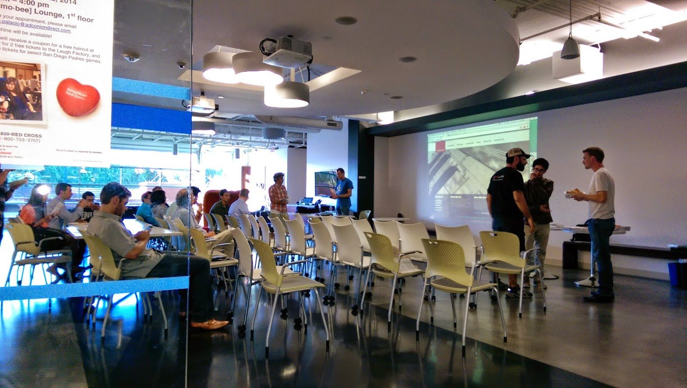
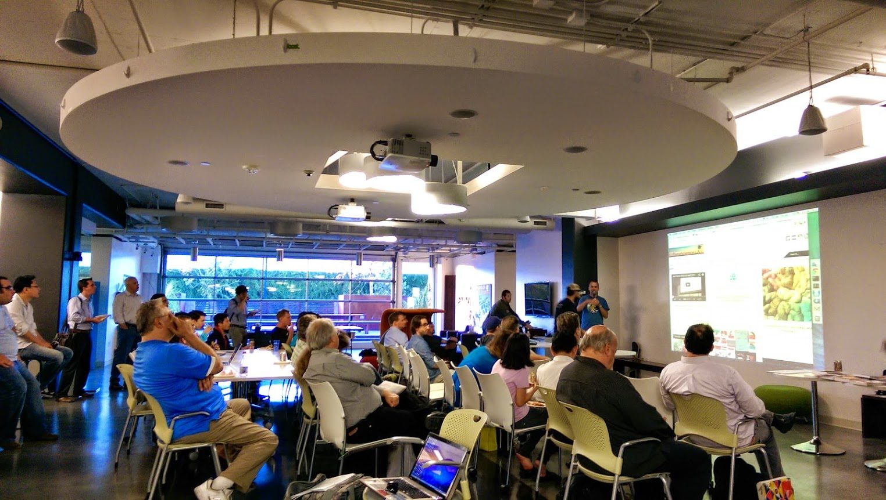
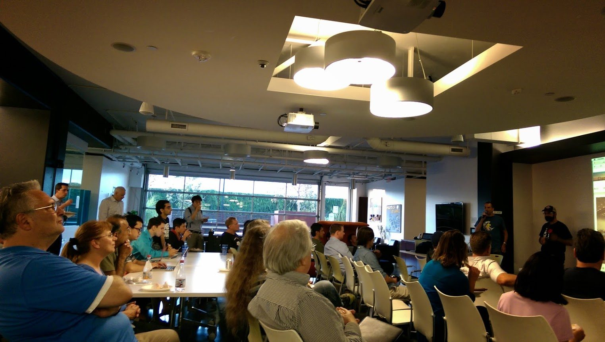
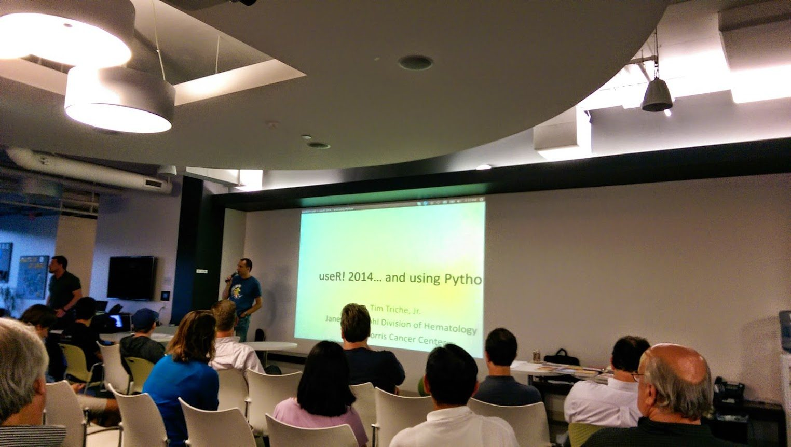

Last week the [LA R meetup](/category/r/) featured 5 speakers each highlighting a few things they had found interesting at the [useR! 2014 conference](http://user2014.stat.ucla.edu/) (which I had the pleasure of helping to organize this year in Los Angeles). This meetup proved to be interesting even to those of us who attended the conference (which was about half of our audience), simply because there were so many cool things to hear and enough parallel sessions at the conference that no one could possibly capture all of the action.

Even better than the talks were the slides, which were packed with more goodies to share. Unless you have the superpowers to absorb all that info on the fly *and* happened to attend the meetup, you might find it useful to skim again through these slides, which we've posted below. (In fact, due to the sheer awesomeness of the conference, I have 5 more volunteer speakers who would like to share their thoughts in a subsequent LA R meetup!)

Our first speaker [Tim Triche](http://www.linkedin.com/in/ttriche), a Fellow at the USC Norris Comprehensive Cancer Center, started with the 3 approaches to interfaces [discussed by John Chambers in his keynote](/john-chambers-user-2014-keynote/): Rcpp, RLLVM and h2o. He then started to compare R and Python from these and a few other perspectives (e.g. data.frames, visualization, etc.), which included strong opinions and funny critiques of the trailing tool in each particular domain. The slides are embedded right here below, however if you are not reading this post directly on DataScience.LA and you cannot see them, [they are also linked here](https://speakerdeck.com/datasciencela/tim-triche-highlights-of-user-conference-la-r-meetup-sep-2014).



Our next speaker [Shannon Callan](http://www.linkedin.com/in/shannoncallan), Founder of Digital Trend Analytics, discussed [three useR talks on finance topics](https://speakerdeck.com/datasciencela/shannon-callan-highlights-of-user-conference-la-r-meetup-sep-2014) which includes useful tidbits on portfolio management and Bayesian change-point analysis - the slides to which are embedded below.



Next, [Juan Natera](http://www.linkedin.com/pub/juan-natera/5/6b/bb4), Senior Software Engineer at Campus Explorer briefly discussed what I think it is the most important R-related takeaway from 2014: [dplyr](http://blog.rstudio.org/2014/01/17/introducing-dplyr/). If you happen to have been using it for months then join the club; if you heard about it at useR and started using it then you're on your way. But if are not using it - or have not even heard of it, please go try dplyr *today*... and you're guaranteed to be more productive *tomorrow*. Slides from Juan's talk are [linked here](https://speakerdeck.com/datasciencela/juan-natera-highlights-of-user-conference-la-r-meetup-sep-2014) if you don't see them embedded below.



Then, [Wayne Smith](http://smithw.org/) of California State University, Northridge touched on some new R books, R packages of note and a few posters he liked ([link here](https://speakerdeck.com/datasciencela/wayne-smith-highlights-of-user-conference-la-r-meetup-sep-2014)).



Finally, Arno Vigen, CFO of AireSpring, summarized a few of the business-oriented talks from useR ([R Connector to Salesforce.com](http://www.slideshare.net/hiratake55/use-r2014-rforcecomv01) (links to the useR talk's slides) and [R AnalyticFlow](http://user2014.stat.ucla.edu/abstracts/talks/65_Suzuki.pdf) (links to PDF of the talk's original slides).

To get a feel of the meetup, here are a few pictures courtesy [Carl Mullins](http://www.linkedin.com/pub/carl-mullins/77/765/52a). Thanks, Carl!

Finally, big thanks to [Amobee](http://www.amobee.com/) (formerly Adconion) for hosting us and for pizza (and special thanks to my friend Mikhail for making all the necessary arrangements).

Stay tuned for another round of talks about the useR conference at the next LA R meetup in November, with an announcement soon!
