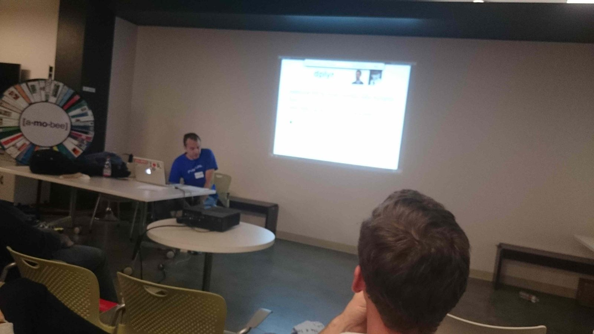
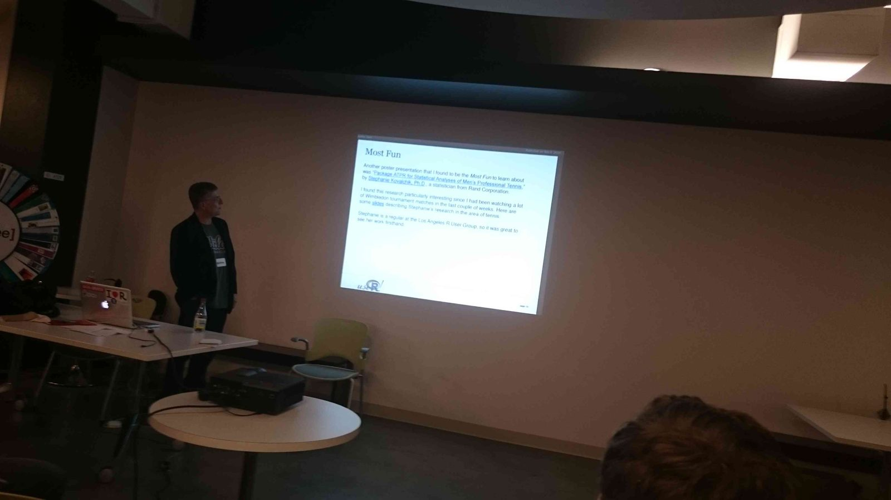

Last week the [LA R meetup](/category/r/) featured another round of 5 speakers each highlighting a few things they had found interesting at the [useR! 2014 conference](http://user2014.stat.ucla.edu/). This was the second such event after the [first one in September](/la-r-meetup-summary-highlights-from-the-user-2014-conference/) - probably because useR! was awesome enough that it inspired 10 volunteers to stand up on stage and talk more about it.

This event had quite a few speakers of note. Over the last 5+ years since I've been organizing the [R meetup in LA](http://www.meetup.com/Los-Angeles-R-Users-Group-Data-Science/) (which retrospectively was also the very first data science meetup in Los Angeles - Machine Learning, Hadoop and many others followed years later), I've had the chance to get to know quite a few members of the LA data community, and it happens that a majority of the speakers for this meetup were top-notch professionals who have also given a few of our data talks previously. Therefore, expectations ran high...

While I ([Szilard Pafka](http://www.linkedin.com/in/szilard)) was the first speaker and I originally planned to talk about my perspective as an organizer at useR! followed by a high-level overview of the conference, but a few days before the meetup I decided to talk about using dplyr with largish datasets instead (a very [simple benchmark](https://github.com/szilard/benchm-dplyr-dt) I've been running and have been excited about). Since I'd like to expand this idea for our blog, I'll save the summary of this part for a subsequent post in the next few days - so stay tuned!

Our second speaker, [Ajay Gopal](http://www.linkedin.com/in/ajaykumargopal), the data everything guru at the Santa Monica startup [CARD.com](https://www.card.com/) talked about a few aspects of using R in production. Ajay was also one of our excellent panelists at the previous [LA R meetup about R in production](/r-in-production-panel-discussion-la-r-meetup-user-2014/) organized during one of the evenings during the conference this past July.

One of Ajay's main challenges at CARD.com is to develop and operate a software infrastructure ecosystem heavily built on/around R. He noted happily that R has come a long way and there are now several options for taking a piece of R code and deploying it in 15 minutes into an application that can run on the Web and be used by many or consumed by other software components. He mentions several solutions such as Jeroen Ooms' [OpenCPU](https://www.opencpu.org/), RStudio's [shiny](http://shiny.rstudio.com/), Revolution Analytics' [DeployR](http://deployr.revolutionanalytics.com/), Gergely Daroczi's [rapporter.net](http://rapporter.net/welcome/en) as well as [Domino Data Labs](http://www.dominodatalab.com/). You can see Ajay's slides here:



Our next speaker was [Eric Kim](http://www.linkedin.com/pub/eric-kim/5/a97/159), Director of Analytics at [The Search Agency](http://www.thesearchagency.com/), who talked about using Shiny to build custom interactive reports in order to optimize SEM revenues for advertisers. When Eric was tasked with building the analytics infrastructure at his company, he decided to turn to R and Shiny instead of the traditional "Business Intelligence" (BI) products. He showed us some of this progress, and we must say we are all cheering for both him and Shiny! (Note: there were no slides available from Eric's talk because of his presentation format)

Our forth speaker was [Daniel Gutierrez](https://www.linkedin.com/in/ddgutierrez) of Amulet Analytics who is also a managing editor and author at [insideBIGDATA](http://insidebigdata.com/). He gave his 'Best Of' the conference in several categories which you can view here:



Finally, our awesome DataScience.LA volunteer/co-founder [Eduardo Ariño de la Rubia](/team/#earino) of [Ingram Content Group](http://www.ingramcontent.com/pages/home.aspx) gave a talk about R package dependency management in software deployments and RStudio's [packrat](https://rstudio.github.io/packrat/). Fortunately for us users (but somewhat unfortunately for his talk, hehe) RStudio made packrat so easy to use in the latest RStudio release that all you need now is to check a "Use packrat" box when you create a new RStudio project. (Eduardo referred to that box "This is my whole dumb talk" in the slides). Nevertheless, he gives us some insights about how packrat works when used from the command line. See his slides here:



With all these great talks, this was certainly an amazing evening! We'd like to give a big Thank You to [Amobee](http://www.amobee.com/) (formerly Adconion) for hosting this meetup and for providing pizza. (Also, a special thanks to my friend Mikhail for making all the necessary arrangements!)

Below, we leave you with a few pictures from the event:

