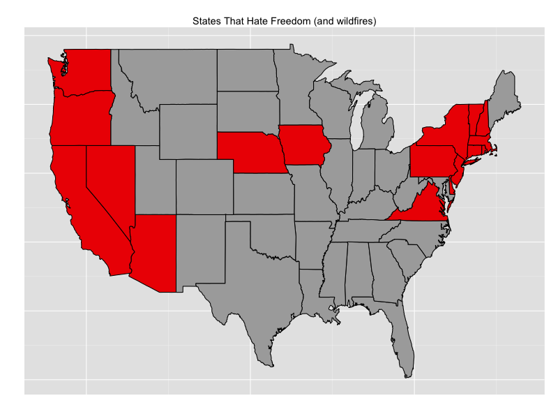
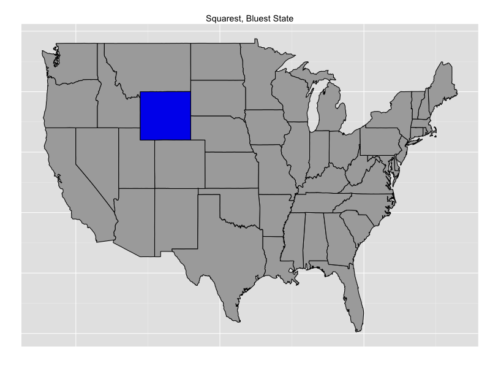

I’ve had a lifelong fascination with maps, and working with R definitely enables my map habit. Perhaps there’s something about being an immigrant that made me particularly introspective, since from a very early age I was aware that I was “from” one place on the map and now lived at this "other place.”

Some of my earliest family memories are of my father calling out a random city such as Reykjavik and my sister and I scrambling in response to be the first to find it on one of the many world atlases distributed throughout our house. They’re very fond memories, since playing Find the Wacky-Sounding City is a fantastic way to spend time with your kids.

One of my other favorite things to do is express my love of humor and my love of maps through ggplot. I love building facetious maps to amuse my Twitter followers, and recently discovered a lovely little data set containing states where it is *illegal* to have fireworks delivered.

So I wrote a little R function for the Fourth of July that put together a joke map and delivers a zinger:

```r
joke_map <- function(states_to_highlight, title="", highlight_colors=c("#aaaaaa", "#ee0000")) {
  library(dplyr)
  library(ggplot2)
  library(RColorBrewer)
  library(maps)

  highlighting = data.frame(region=tolower(state.name[match(states_to_highlight, state.abb)]),
                             highlight=TRUE)

  d = map_data("state") %>% left_join(highlighting, by="region")
  d[is.na(d$highlight),]$highlight <- FALSE

  p <- ggplot(d) + geom_polygon(aes(x=long, y=lat,
                                   group = group, fill=highlight),
                               colour="black") +
    scale_fill_manual(values=highlight_colors) +
    ggtitle(title) +
    xlab("") +
    ylab("") +
    theme(axis.ticks = element_blank(), axis.text.x = element_blank(), axis.text.y = element_blank()) +
    guides(fill=FALSE)

  p
}
```

<small>Source: [gist ab49e04](https://gist.github.com/earino/ab49e04282f047eedfde) by earino</small>

Not exactly groundbreaking R code, I know, but quite handy. I was able to simply call the function with dataset I had found at [fireworks.us](http://www.fireworks.us/help_answer.asp?ID=21#132) and have a little chuckle.



Enjoy the code, and have fun generating imaginary internet points! As I get older, I've also been working on my Dad joke superpowers, so I'll leave you with my latest masterpiece:

```r
map <- joke_map(states_to_highlight = c("WY"), title = "Squarest, Bluest State", highlight_colors=c("#aaaaaa", "#0000ee"))
```

<small>Source: [gist 65623ce](https://gist.github.com/earino/65623ce966c2f9e29e4d) by earino</small>


