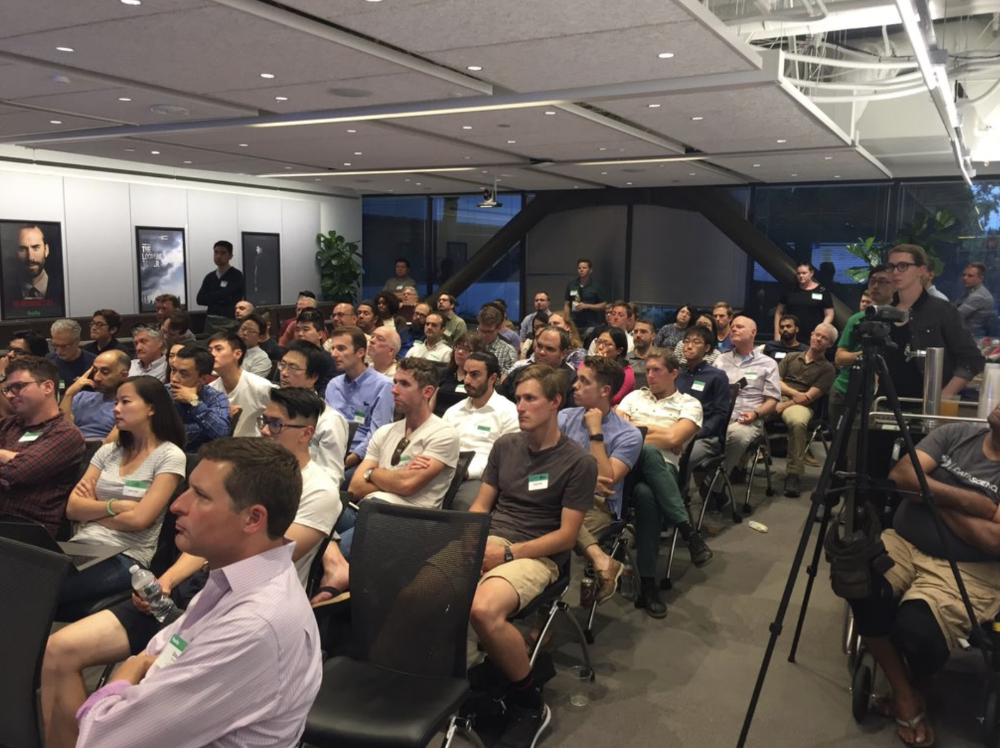
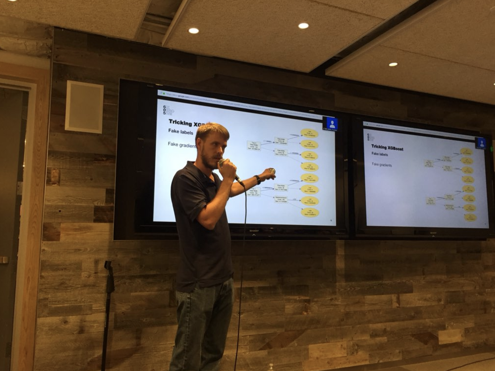
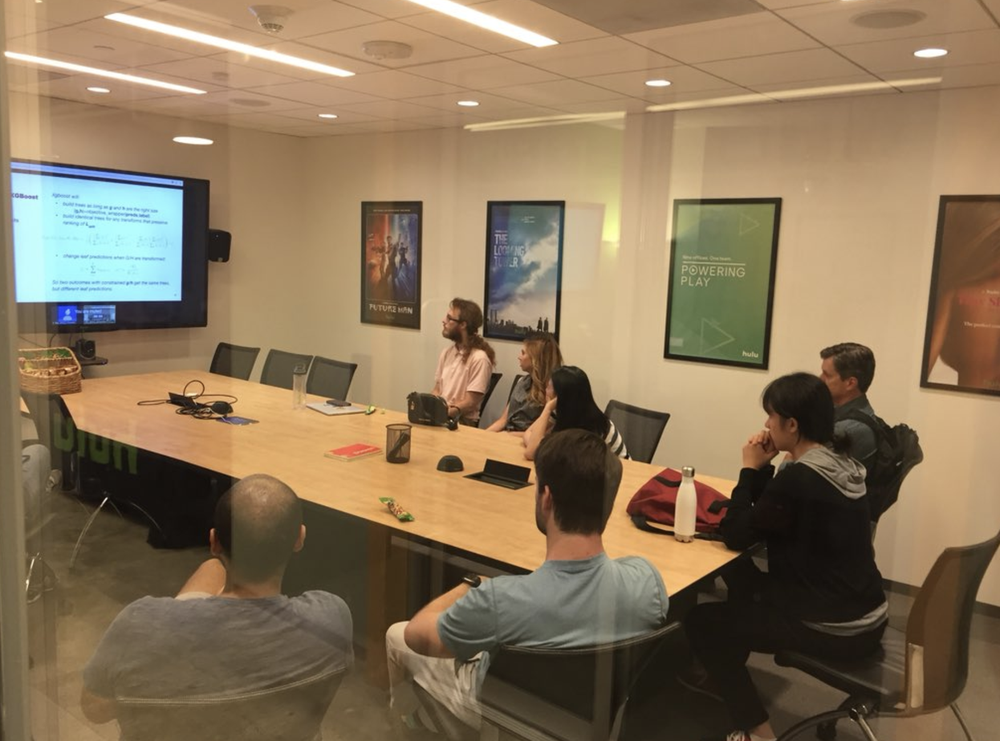
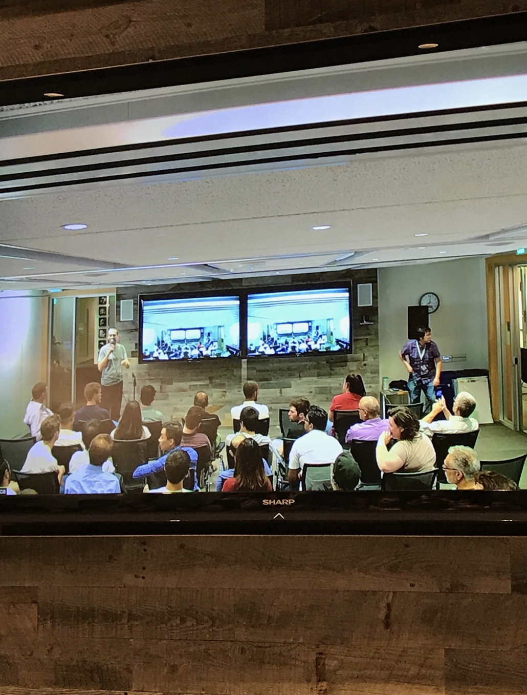

**Update_1: Slides for the 4 talks added below (at each talk section separately).**

**Update_2: Photos from the meetup and a short description of the event added below (at the bottom of the post).**

**Update_3: Video recording of the meetup here:**



In this event we had a main talk (30 mins) and 3 excellent lightning talks about gradient boosting machines (GBMs). GBM is the machine learning algorithm that usually achieves the best accuracy on structured/tabular data beating other algorithms such as the much hyped deep neural networks (deep learning).

**Better than Deep Learning: Gradient Boosting Machines (GBM)**

**by Szilard Pafka, PhD**\
**Chief Scientist, Epoch**

Abstract: With all the hype about deep learning and "AI", it is not well publicized that for structured/tabular data widely encountered in business applications it is actually another machine learning algorithm, the gradient boosting machine (GBM) that most often achieves the highest accuracy in supervised learning tasks. In this talk we'll review some of the main GBM implementations available as R and Python packages such as xgboost, h2o, lightgbm etc, we'll discuss some of their main features and characteristics, and we'll see how tuning GBMs and creating ensembles of the best models can achieve the best prediction accuracy for many business problems.

Slides [here](http://bit.ly/szilard-talk-lajuly18).

Bio: Szilard studied Physics in the 90s and obtained a PhD by using statistical methods to analyze the risk of financial portfolios. He worked in finance, then more than a decade ago moved to become the Chief Scientist of a tech company in Santa Monica doing everything data (analysis, modeling, data visualization, machine learning, data infrastructure etc). He is the founder/organizer of several meetups in the Los Angeles area (R, data science etc) and the data science community website datascience.la. He is the author of a well-known machine learning benchmark on github (1000+ stars), a frequent speaker at conferences (keynote/invited at KDD, R-finance, Crunch, eRum and contributed at useR!, PAW, EARL etc.), and he has developed and taught graduate data science and machine learning courses as a visiting professor at two universities (UCLA and CEU in Europe).

**Lighting talks:**

**1. Not your father’s objective function - weird things you can do with xgboost**

**by Peter Foley**\
**Vice President, Analytics at 605**

XGBoost makes it easy to predict a variety of different outcome types -- binary, continuous, ranked, categorical, count, and also custom objective functions for specialized needs. Those custom objective functions let you do some even weirder stuff that you might not expect. I’ll give examples of hacking custom objectives to fit vector-valued outcomes and local linear regressions, and give tips on how to plug your own weird functions into xgboost to take advantage of it’s powerful and fast tree construction.

Bio: Peter leads the analytics and data science team, and manages 605’s behavioral modeling and experimentation. 605 offers unique, independent television audience measurement and analytics to build better marketing and programming initiatives within the media and entertainment industries. Most of Peter’s work is management, but he maintains involvement in the group’s experimental method development, machine learning techniques, and scalable modeling infrastructure.

Slides [here](https://docs.google.com/presentation/d/1PxRpIR2RwNoY6HQ5_Lol6GX7xaBH3Q998EnWieZwq_8/edit?usp=sharing).

**2. GBM model interpretability**

**by Michael Tiernay**\
**Senior Data Scientist at Netflix**

Slides [here](https://docs.google.com/presentation/d/14R8hkQF1YBFUNWxZaB5WjpmcpSUOLlfxhQWNB4WE_9E/edit?usp=sharing).

**3. Why lightGBM become my 1st choice in Kaggle?**

by Hang Li\
Hulu

Xgboost has become the most popular algorithm in Kaggle competitions 3 or 4 years ago. Recently, another open source GBM implementation (lightGBM) was introduced to the Kaggle community by Microsoft. Due to its good performance, it has become my 1st choice for Kaggles. In this talk will briefly introduce some of the nice features of lightGBM.

Bio: Hang is a Competition Master at Kaggle. He participated in over 30 Data Science Competitions. He has a strong passion for using machine learning techniques to solve real-world problems.

Slides [here](http://bit.ly/hang-why-lightGBM).

---

This meetup was pretty wild. The meetup sold out in 56 minutes from announcement. Another 200+ people signed up for the waitlist. Then, my prediction about the show-up rate was way off (isn't that ironic for a machine learning meetup?), so the room reached the max capacity just by too many people with RSVPs showing up (never had that before, usually about 50-60% show up). Thankfully, our hosts at Hulu figured it out and set up an overflow room and streamed the show to it. The rest of the event was smooth, lots of people, great talks, lots of good questions and discussions. It was a great event after all! Thanks again Hulu for hosting us. An special thanks to Carl Mullins for recording the meetup and making the video available (embedded at the top of this post) to all of you who could not attend (either being on the waiting list or not living in LA).

