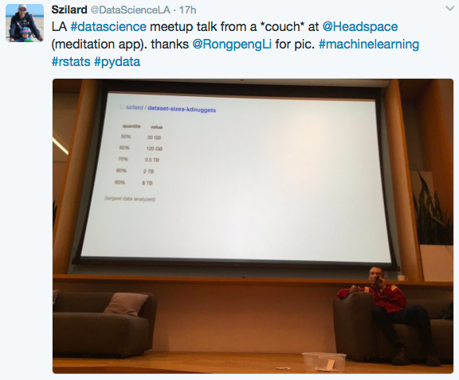

**Update: Slides here:**

Slides: <https://speakerdeck.com/szilard/machine-learning-meetup-febr-2017>

Our next meetup:

**No-Bullshit Data Science**\
**by Szilard Pafka**

Abstract: While extracting business value from data has been performed by practitioners for decades, the last several years have seen an unprecedented amount of hype in this field. This hype has created not only unrealistic expectations in results, but also glamour in the usage of the newest tools assumably capable of extraordinary feats. In this talk I will apply the much needed methods of critical thinking and quantitative measurements (that data scientists are supposed to use daily in solving problems for their companies) to assess the capabilities of the most widely used software tools for data science. I will discuss in details two such analyses, one concerning the size of datasets used for analytics and the other one regarding the performance of machine learning software used for supervised learning.

Bio: Szilard studied Physics in the 90s and has obtained a PhD by using statistical methods to investigate the risk of financial portfolios. Next he has worked in a bank quantifying and managing market risk. About a decade ago he moved to Santa Monica, California to become the Chief Scientist of a credit card processing company doing everything data (ETL, analysis, modeling, visualization, machine learning etc). He is also the founder/organizer of several data science related meetups in Santa Monica (LA R, Data Science/Machine Learning, DataVis LA etc.) and the data community website [datascience.la](/). LinkedIn: [szilard](https://www.linkedin.com/in/szilard) Twitter: [@DataScienceLA](https://twitter.com/DataScienceLA) Github: [@szilard](https://github.com/szilard)

**Timeline:**

- 6:30pm arrival, food/drinks and networking
- 7:30pm talk starts
- 8:30 pm more networking

You must have a confirmed RSVP and please arrive by 7:25pm the latest. Please [RSVP here on Eventbrite](https://www.eventbrite.com/e/no-bullshit-data-science-tickets-31990332947).

**Venue:** Headspace, 2415 Michigan Avenue, Santa Monica. Thanks for hosting and providing food/drinks!
