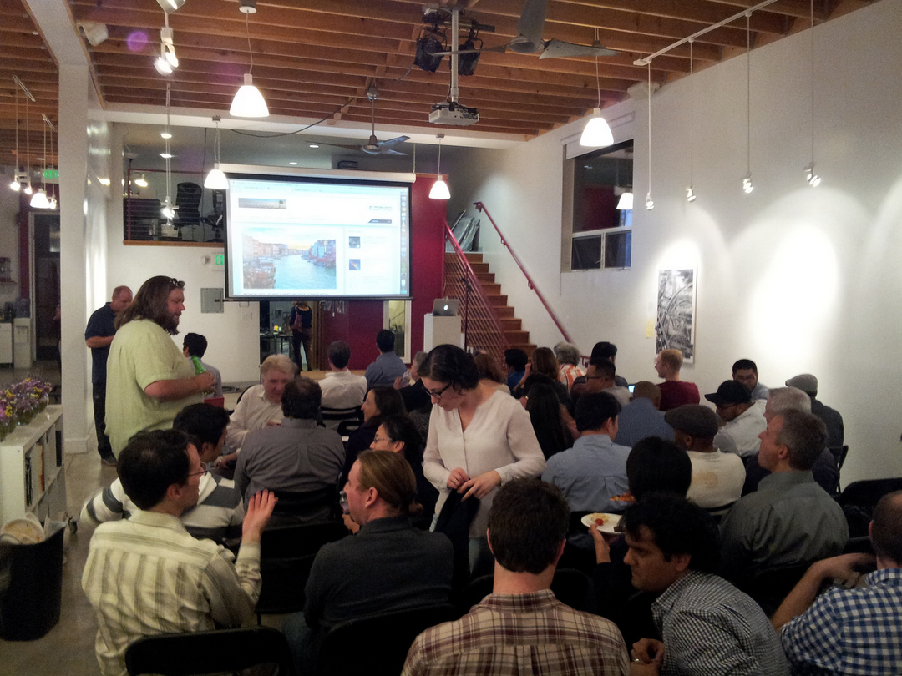
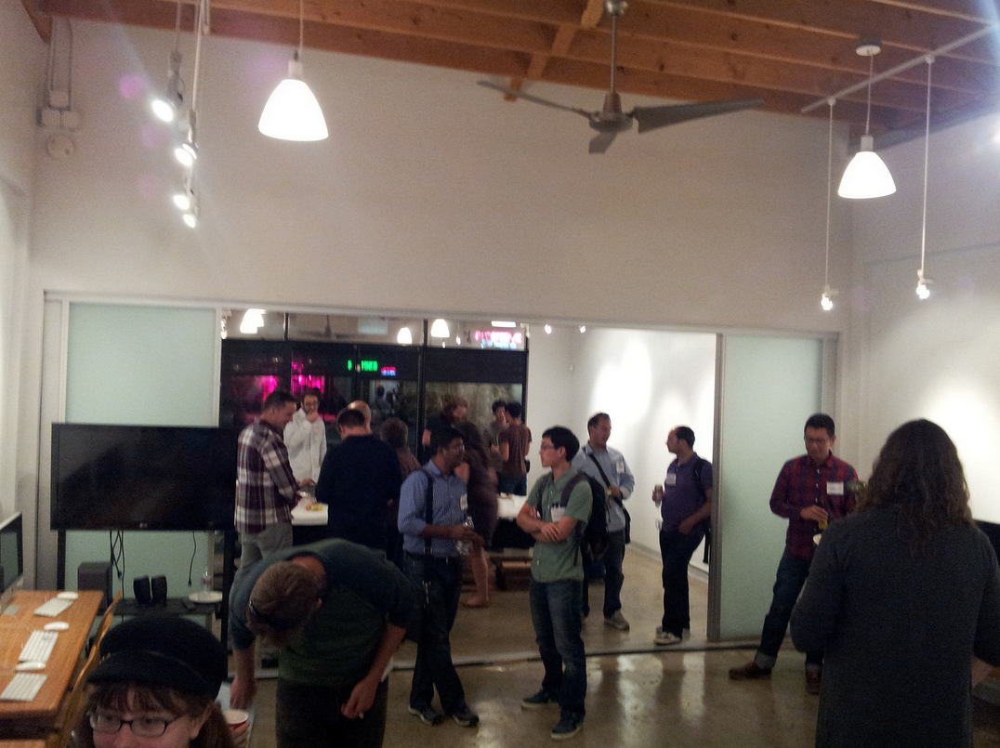
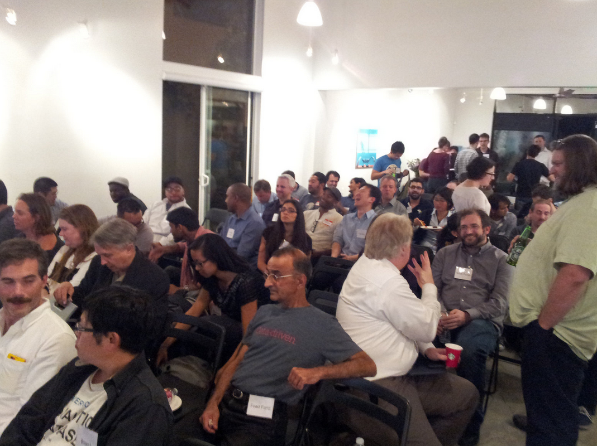

Last week, the Python Data Science LA meetup debuted with a fabulous event. It was already much anticipated, with more than 250 people showing interest (RSVP+waiting list), and a lucky 100 converged upon the hip Venice Arts venue to hear our speakers. Our sponsor [OpenMail](http://www.openmail.com/) has also done a fantastic job in getting us this venue, bringing food+drinks and taking care of all the details. Thanks OpenMail Team!

In this first event, we (your organizers, [Szilard](/team/#szilard) and [Eduardo](/team/#earino)) wanted to showcase Python tools used during the various parts of the data analysis process (data munging, data visualization, modeling) and also highlight an environment that facilitates an interactive (and productive) workflow. At the expense of having a very long night, we managed to discuss quite a few topics: pandas for data munging, various visualization libraries, scikit-learn for modeling/machine learning, the IPython notebook as an environment for interactive data analysis - and in addition, we also had a talk on parallel processing. It was an exciting evening indeed!

All these topics were delivered by 5 awesome speakers (thanks again to our speakers for volunteering!) While the talks were perfectly accessible, the amount of information presented was quiet overwhelming, so we have prepared this post for the benefit of both those attending the event as well as those who couldn't make it. Below we bring you the slides, code (IPython notebooks) and the video recording of each talk (thanks to our volunteer videographer [Jeff Weakley](/team/#jeff_weakley) for the work with the videos!)

We also have to thank all those attending for providing a vibrant atmosphere during the networking hour before the talks, as well as their attentiveness during the presentations (and thanks for that patience - it was a really long meetup). Finally, I would like to point out that about half of the attendees (including ourselves the organizers) are also using R, as R and Python are the 2 most widely used (and best :)) tools for data science. For more on this, please see our  [post on our survey conducted at a previous Data Science meetup](/data-science-toolbox-survey-results-surprise-r-and-python-win/) to see what's commonly used for data munging/datavis/modeling. It's important to note that this survey was one of the main drivers that led us to start this Python Data Science meetup group, based upon the ideas driving those meetups currently serving the R community in LA.

Our first speaker [John Fries](http://www.linkedin.com/pub/john-fries/4b/698/a65) (CTO of OpenMail, formerly software engineer at Google) took first the stage to talk about [pandas](http://pandas.pydata.org/). We all know that we data scientists spend 80% of our time with data munging and the joke says the remaining 20% is spent complaining about the need to do data munging. Considering this truism, having a library that provides a high level and expressive API for manipulating tabular data is essential for our productivity. In order to be efficient (i.e. fast and with low memory footprint) it has to store its columns contiguously in memory and provide bulk operations (unlike e.g. a matrix built of Python lists). Pandas achieves this by building on top of Numpy and provides operations e.g. for filtering, aggregation or joining - not surprisingly similar in scope (and syntax) to SQL. It is an essential tool for data science with Python.

See John's slides here:



and the video recording of his talk here:



[John Lin](http://www.linkedin.com/pub/john-lin/46/831/410), Data Scientist at TrueCar and former experimental economist presented on [IPython notebooks](http://ipython.org/notebook.html). Collaboration and communication issues are central to the work of a data scientist, from being able to provide reproducibility in findings to effortless communication, iPython notebooks address many of these problems. Showcasing their capabilities as a programming and data science environment, John discussed the interaction method and some great tips and tricks for power users. IPython notebooks are particularly powerful as a collaboration tool for a team of data scientists. The ability to send someone on your local network a link to your notebook or to serialize notebooks and make them available has certainly ignited and accelerated innovation the PyData ecosystem.

Slides:



You can also view his [IPython notebook here](http://nbviewer.ipython.org/github/datasciencela/code-from-meetup-talks/blob/master/201411-PyDSLAmeetup-JohnLin-IPythonNotebook/John-Lin-LA-Python-Data-Science-Meetup.ipynb).



Our next speaker, [Tamara Knutsen](http://www.linkedin.com/pub/tamara-knutsen/1/82a/960) (Front End engineer at OpenMail) provided a survey of the available visualization options in Python. Visualization is central to the work of data scientists, particularly during exploratory analysis. Being able to take complex multi-dimensional data, in which human intuition would fail, and provide visual artifacts which can be reasoned about is one of the most powerful sense-making tools available to a data scientist. In the past, the Python visualization ecosystem had been unfavorably compared with options in other Data Science environments. Tamara's presentation, containing a series of compelling visualizations built in an iPython notebook, also showcased some of the more modern tools for visualization and exploratory data analysis. Starting with the venerable [Matplotlib](http://matplotlib.org/) to build some standard visualizations, her presentation quickly moved on to some fantastic advanced topics such as graph applications and interactive visualizations. From [Seaborn](http://web.stanford.edu/~mwaskom/software/seaborn/) to [Bokeh](http://bokeh.pydata.org/), from heatmaps to violin charts, this presentation is a fantastic resource for anyone who wants to get up to speed quickly on data visualization leveraging the PyData ecosystem.

You can view her [IPython notebook (including awesome plots) here](http://nbviewer.ipython.org/github/datasciencela/code-from-meetup-talks/blob/master/201411-PyDSLAmeetup-TamaraKnutsen-VisualizationTools/Python_Plotting_Libraries.ipynb).



[Rudy Gilmore](http://www.linkedin.com/in/rudycgilmore), a Data Scientist at TrueCar, then presented the incredibly technical topic of parallelism in an easy to understand and accessible fashion. As the limits of physics have been reached and individual CPUs are no longer getting faster, processor manufacturers have adopted the strategy of multiple on-die cores and multiple processors in servers. While this still provides a platform for faster processing and more powerful algorithms, it requires programmers [take a step back](http://en.wikipedia.org/wiki/Amdahl's_law) from sequential [SISD](http://en.wikipedia.org/wiki/SISD) programming models. Rudy gave examples of different classes of algorithms, including which ones were better candidates for parallel applications, and discussed Python modules for ([threading](https://docs.python.org/2/library/threading.html) and [multiprocessing](https://docs.python.org/2/library/multiprocessing.html)) while discussing approaches that would best fit each of these cases.

Slides:





[Eduardo Ariño de la Rubia](/team/#earino) had the privilege of being the final speaker at our inaugural meetup. The organizers decided we couldn't have a Python Data Science meetup without including discussion of the fantastic machine learning ecosystem available to python users in [scikit-learn](http://scikit-learn.org/stable/). Unfortunately giving a 10-minute presentation on machine learning and scikit-learn is quite a challenge, so it focused on providing a high level view of the different machine learning API's exposed by scikit-learn. Starting with unsupervised techniques such as [dimensionality reduction](http://en.wikipedia.org/wiki/Dimensionality_reduction) and [clustering](http://en.wikipedia.org/wiki/Cluster_analysis), then showcasing the [classification](http://en.wikipedia.org/wiki/Statistical_classification) and [regression](http://en.wikipedia.org/wiki/Regression_analysis) algorithms, Ed attempted to provide a survey of what can be accomplished within the scikit-learn ecosystem.

Slides:





Since we are a brand new, young meetup, we want to make sure the Los Angeles Python community knows we are actively looking for speakers! If you are interested in giving either a 30-60 minute talk or a 5-10 minute lightning talk on a Python Data Science topic, [drop us a line](mailto:info@datascience.la)!

In summary it was an awesome start for a new meetup and we hope to see you at our next event!

Your Co-Organizers,\
Szilard & Eduardo\
(this post has been written indeed by the two of us ;))

p.s. - Below are some pictures of our inaugural audience. Enjoy!

with some [more pictures here](https://secure.flickr.com/photos/data-science-la/sets/72157646854529394/).
