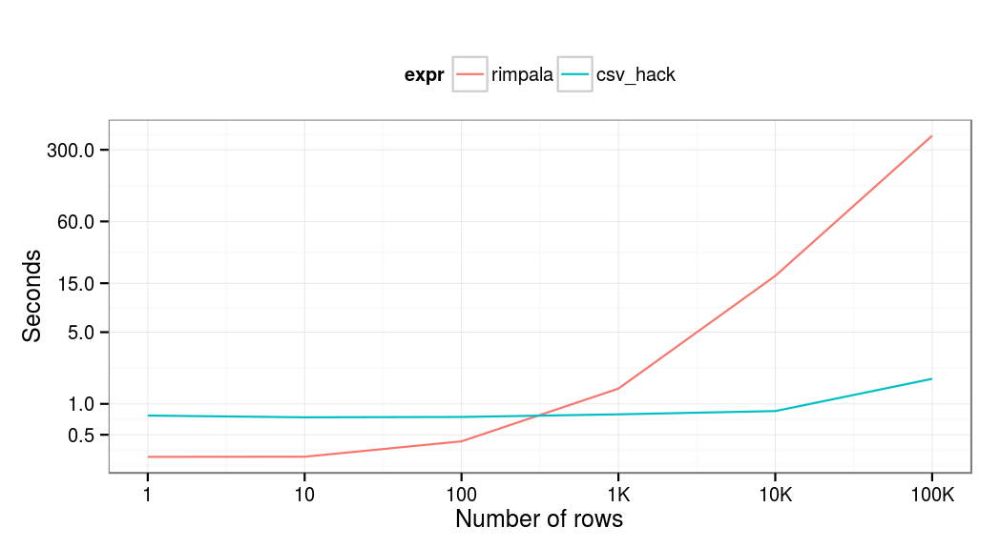
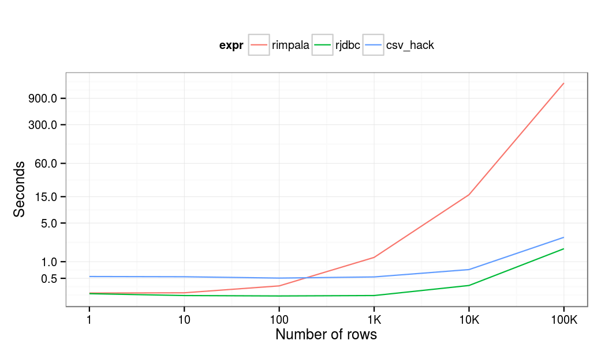

One of the best things I like in working at [CARD.com](http://card.com) is that I am not only crunching [R](http://r-project.org) code in 24/7, but I also have the chance to interact with and improve the related data infrastructure with some interesting technologies.

After joining the company in January, I soon realized that while [Impala](http://www.cloudera.com/content/cloudera/en/products-and-services/cdh/impala.html) is a very [powerful](http://allegro.tech/2015/06/fast-data-hackathon.html) database for handling data that do not comfortably fit in MySQL, it's still not as fast as one might expect when querying large amount of data from R. Sometimes I had to wait several minutes for a query to run! So I used this spare time to think about how to improve the workflow.

Interacting with Impala from R is pretty straightforward: just install and load the [RImpala package](https://cran.r-project.org/web/packages/RImpala/index.html), which uses the JDBC driver to communicate with Impala. It does the job very well for fetching aggregated data form the database, but gets extremely slow when loading more than a thousand or so row -- that you cannot resolve buy throwing more hardware on the problem.

So when loading larger amount of data, the related R process is running with 100% CPU usage on one core, while doing the very same query from bash via `impala-shell`, the results are returned pretty fast. Why not exporting the data to a CSV file via `impala-shell` then?

**TL;DR:** loading data into/from Impala via an intermediary CSV file may perform a lot better compared to using the JDBC driver.

## Benchmark

To compare the performance of the two approach in a reproducible way, I started an Elastic MapReduce cluster on AWS with a single `m3.xlarge` instance running the AMI version 3.8.0 with Impala 1.2.4 -- R already pre-installed. Then I downloaded the `dbgen` utility to generate some data for the benchmarks, as described in the [Amazon EMR docs](http://docs.aws.amazon.com/ElasticMapReduce/latest/DeveloperGuide/query-impala-generate-data.html):

```bash
$ dir test; cd test
$ wget http://elasticmapreduce.s3.amazonaws.com/samples/impala/dbgen-1.0-jar-with-dependencies.jar
$ java -cp dbgen-1.0-jar-with-dependencies.jar DBGen -p /tmp/dbgen -b 1 -c 0 -t 0
```

Then put the generated pipe-delimited data files on HDFS:

```bash
$ hadoop fs -mkdir /data/
$ hadoop fs -put /tmp/dbgen/* /data/
$ hadoop fs -ls -h -R /data/
```

And load the data into Impala (not dealing with transforming the data into the Parquet File format or other tweaks as now we are comparing data transfer speed of the connectors):

```sql
create EXTERNAL TABLE transactions(id BIGINT, customer_id BIGINT, book_id BIGINT, quantity INT, transaction_date TIMESTAMP) ROW FORMAT DELIMITED FIELDS TERMINATED BY '|' LOCATION '/data/transactions/';
```

Now we need to install the `RImpala` package, then download and extract the `zip` of JDBC jars as [described on the package GitHub page](https://github.com/Mu-Sigma/RImpala#loading-rimpala-and-connecting-to-impala):

```r
> install.packages('RImpala')
> download.file('https://github.com/Mu-Sigma/RImpala/blob/master/impala-jdbc-cdh5.zip?raw=true', 'jdbc.zip', method = 'curl', extra = '-L')
> unzip('jdbc.zip')
```

And all set to interact with the database after initializing the connection to Impala:

```r
> library(RImpala)
Loading required package: rJava
> rimpala.init(libs = 'impala-jdbc-cdh5')
[1] "Classpath added successfully"
> rimpala.connect()
[1] TRUE
> rimpala.query('select count(1) from books')
  count(1)
1 15969976
```

Now let's see what happens when we load 10, 100, 1000 or let's say 10K rows:

```r
> install.packages('microbenchmark'); library(microbenchmark)
> microbenchmark(
+     l1e1 = rimpala.query('select * from books limit 10'),
+     l1e2 = rimpala.query('select * from books limit 100'),
+     l1e3 = rimpala.query('select * from books limit 1000'),
+     l1e4 = rimpala.query('select * from books limit 10000'), times = 10)
Unit: milliseconds
 expr        min         lq       mean     median         uq        max neval
 l1e1   373.8289   391.8877   393.5581   392.6247   400.7414   409.0315    10
 l1e2   526.9520   534.7739   547.1202   543.5515   551.1544   578.5519    10
 l1e3  1236.0779  1872.6034  1887.2793  1948.8703  2125.3348  2222.2258    10
 l1e4 17801.2652 23253.7269 24784.2390 25836.3453 26850.4088 27717.6926    10
```

Almost 30 seconds to fetch 10K rows! Things getting very slow, right? So let's create a minimal working R implementation of the above proposed method to export the results from Impala to a CSV file and load it via `data.table::fread` (due to read performance and I am using `data.table` in most of my R scripts anyway):

```r
> library(data.table)
> query_impala <- function(query) {
+
+     ## generate a temporary file name
+     fn <- tempfile()
+
+     ## remove after read
+     on.exit(unlink(fn))
+
+     ## export results to this file
+     system(paste(
+         'impala-shell -B --quiet -q',
+         shQuote(query),
+         '-o', fn,
+         '"--output_delimiter=,"',
+         '--print_header > /dev/null'))
+
+     ## read (and return) data like a pro
+     fread(fn)
+
+ }
```

Well, this function is extremely basic and can work only on localhost. For a more general approach with SSH access to remote databases, logging features and a bit of error handling, please see the updated `query_impala` function referenced at the end of this post.

But this simple function is fair enough to do some quick benchmarks on how JDBC and the CSV export/import hack performs with different number of rows fetched from Impala. Let's run a loop to load 1, 10, 100, 1K, 10K and 100K values from the database via the two methods, each repeated by 10 times for future comparison:

```r
> benchmarks <- lapply(10^(0:5), function(limit) {
+     query <- paste('select id from books limit', limit + 1)
+     res <- microbenchmark(
+         rimpala  = rimpala.query(query),
+         csv_hack = query_impala(query),
+         times = 10)
+     res$limit <- limit
+     res
+ })
```

And let's transform the results of the benchmarks to an aggregated `data.table`, and plot the averages on a joint (log-scaled) graph:

```r
> df <- rbindlist(benchmarks)[, .(time = mean(time)), by = .(expr, limit)]
> library(ggplot2)
> ggplot(df, aes(x = limit, y = time/1e9, color = expr)) + geom_line() +
+     scale_y_log10(breaks = c(0.5, 1, 5, 15, 60, 60*5, 15*60)) +
+     scale_x_log10(breaks = 10^(0:5),
+                   labels = c(1, 10, 100, '1K', '10K', '100K')) +
+     xlab('Number of rows') + ylab('Seconds') +
+     theme_bw() + theme('legend.position' = 'top')
```



Unfortunately, I did not have patience to run this benchmark on more rows or columns, but this is already rather impressive in my (personal) opinion. In short, if you are querying more than a 100 rows from Impala and you have (SSH) console access to the server, you'd better use CSV export instead of waiting for the JDBC driver to deliver the data for you.

## Quick comparison of the CSV export and the RImpala approach

Please find this quick comparison of the discussed methods for fetching data from Impala to R:

|  | Advantages | Disadvantages |
| --- | --- | --- |
| **RImpala** | - Can connect to remote database without SSH access - On CRAN | - Slow when querying many rows - Java dependency on the client side - 20 megabytes of jar files for the driver |
| **CSV export** | - Scales nicely - No Java and jar dependencies, it's damn simple | - Needs SSH access for remote connections - Not on CRAN (yet) |

## Second thoughts

So why is it happening? I was not 100% sure, but suspected it must be something with the `jar` files or how those are used in R. The query takes the very same amount of time inside of Impala as it does not matter if you export the data into a CSV file or pass it via the JDBC driver, but parsing and loading it takes extremely long with the latter.

Mentioning these interesting results to [Szilard](/team) at a lunch, he suggested me to give a try directly querying Impala with the `RJDBC` package. It sounded pretty insane to use a different R wrapper to the very the same `jar` files of the `RImpala` package, but I decided to do this extra test after all to make sure it's a Java and not an R implementation issue -- as per my proposal of keeping things simple (KISS) over using Java.

So I unzipped all the `jar` files used by the `RImpala` package above and created a new archive containing the merged content in a file named to `impala-jdbc-driver.jar`. Then loaded the `RJDBC` package and initialized a connection:

```r
> library(RJDBC)
> drv  <- JDBC("org.apache.hive.jdbc.HiveDriver", "impala-jdbc-driver.jar", "'")
> conn <- dbConnect(drv, "jdbc:hive2://localhost:21050/;auth=noSasl")
```

Then we can use the very convenient `dbGetQuery` method from the `DBI` package to fetch rows from Impala, with the following impressive results:



So my hypothesis turned out to be wrong! The JDBC driver performs pretty well, even better compared to the CSV hack. I was even tempted to revert our production R scripts to use JDBC instead of the below function using temporary files to read data from Impala, but decided to keep the non-Java approach for multiple reasons after all:

- No Java dependency on the server. Although storage is cheap nowadays, and I've already created a [minimal Docker image including R, Java and rJava](https://hub.docker.com/r/cardcorp/r-java/), but do we really need that [60% increase in the Docker image size](https://imagelayers.io/?images=rocker%2Fr-base:latest,cardcorp%2Fr-java:latest)? Compare the minimal R Docker image size of [](https://imagelayers.io/?images=rocker/r-base:latest) with the R+Java Docker image of [](https://imagelayers.io/?images=cardcorp/r-java:latest)
- No memory issues when loading large amount of data. By default, the `rJava` packages starts JVM with 512 MB of memory, which might not be enough for some queries, so you have to update this default value via eg `options(java.parameters = '-Xmx1024m')` before loading the `rJava` package.
- I prefer using SSH to access the data even if SSL encryption is available with the JDBC driver as well. This might sound silly, but managing users and authentication methods can be a lot easier via traditional Linux users/groups compared to Impala, especially with older CDH releases. Not speaking about in-database permissions here, of course.
- Although JDBC can be perfect for reading data from Impala, writing to the database might be a nightmare. I am not aware of any bulk import feature via the JDBC driver, and separate `INSERT` statements are extremely slow. So instead of preparing SQL statements, I prefer creating an intermediary dump file to be imported by Impala on the command line -- via a helper R function that does all these steps automatically. I did not prepare any benchmarks on this, but believe me, it's a LOT faster. The same also stands for eg Redshift, where loading data from S3 or remote hosts via SSH and using `COPY FROM` instead of `INSERT` statements can result in multiple orders of magnitude speedup. This hack seems to be used by the [Spark folks](https://databricks.com/blog/2015/10/19/introducing-the-spark-redshift-package.html) as well.

## Proof-of-concept demo function to use intermediary CSV files to export data from Impala

If you find this useful, please see the below function to automate the required steps of using an intermediary file instead of JDBC to load data from Impala :

- connect to a remote host via SSH
- create a temporary CSV file on the remote host
- dump the results of the Impala query to the CSV file
- copy the CSV to a local file
- read the content of the CSV
- clean up the local and remote workspaces.

Comments and any kind of feedback is highly welcomed!

```r
#' Connect and query Imapala via SSH and Impala-shell
#' @param query SQL query to run
#' @param host server hostname or IP
#' @param log enable or disable logging of debug/trace messages
#' @return data.table object
#' @export
query_impala <- function(query, host = 'localhost', log = require(futile.logger)) {

    ## measure time of query
    timer <- proc.time()

    ## make sure the query is a one-liner
    query <- gsub('\n', ' ', query)

    ## try to connect and create a remote temp file
    if (log) flog.trace('Connecting to %s and creating tempfile.', host)
    rfn <- system(paste0(
        'ssh ', host,
        ' "mktemp --tmpdir=/tmp rimpala-XXXXXXXX.csv"'
        ), intern = TRUE)

    ## error handling
    if (length(rfn) == 0) {
        stop('SSH access error.')
    }

    if (log) flog.trace('Remote tempfile: %s', rfn)

    ## build impala-shell query
    cmd <- paste(
        'impala-shell -B --quiet -q',
        shQuote(query),
        '-o', rfn,
        '"--output_delimiter=,"',
        '--print_header > /dev/null')

    ## and log then run it
    if (log) flog.trace(paste0('Querying impala-shell directly via: ', cmd))
    system(paste('ssh', host, shQuote(cmd)))

    ## copy CSV file to localhost
    lfn <- tempfile(pattern = 'rimpala-', fileext = '.csv')
    if (log) flog.trace('Copying tempfile to temporary location on localhost: %s', lfn)
    system(paste0(
        'scp -q -C ', host, ':',
        rfn, ' ', lfn))

    ## read data like a pro
    if (log) flog.trace('Reading %s bytes of data.', file.info(lfn)$size)
    res <- tryCatch(fread(lfn, sep = ','), error = function(e) e)

    ## if we cannot read data as a pro
    if (inherits(res, 'error')) {
        res <- data.table(read.csv(lfn))
    }

    ## cleanup
    if (log) flog.trace('Deleting temporary files on localhost and remote.')
    unlink(lfn)
    system(paste('ssh', host, 'rm', rfn))

    ## log query time
    if (log) flog.trace('Query finished with %s rows after %s seconds.',
                        nrow(res),
                        round(as.numeric(proc.time() - timer)[3], 2))

    ## return
    res

}
```

<small>Source: [gist 353c714](https://gist.github.com/daroczig/353c7140c9e45d7cc2db) by daroczig</small>
