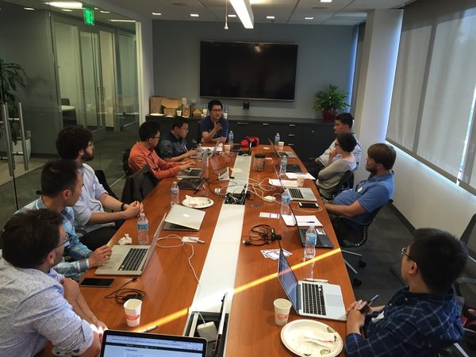
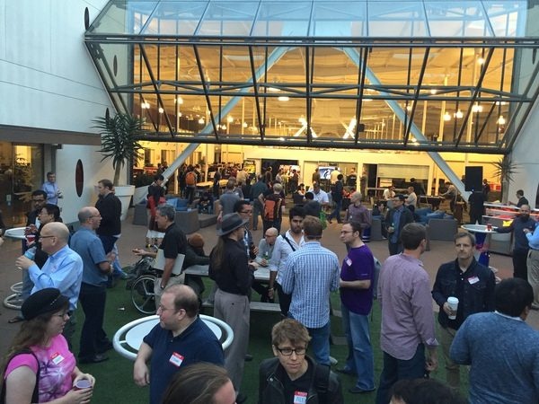
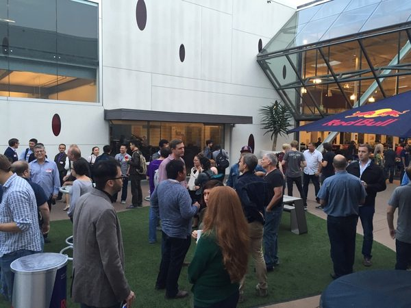
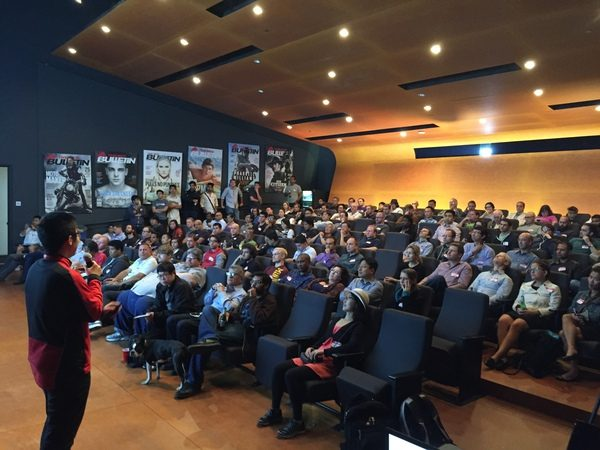

[XGBoost](https://github.com/dmlc/xgboost) is a fantastic open source implementation of [Gradient Boosting Machines](https://en.wikipedia.org/wiki/Gradient_boosting), a general purpose supervised learning method that achieves the highest accuracy on a wide range of datasets in practical applications. Deep learning is all the hype now, but apart from specific domains such as images, speech or text (i.e. problems with higher-level abstractions to be learnt and/or perception problems, where deep learning achieved some remarkable results indeed), it is usually outperformed by Gradient Boosting in a majority of general business domains and supervised learning applications. Proof of this and also because XGBoost has an easy-to-use interface from both [R](http://dmlc.ml/rstats/2016/03/10/xgboost.html) and Python, XGBoost has become a favorite tool in Kaggle competitions. Besides feature engineering, cross-validation and ensembling, XGBoost is a key ingredient for achieving the highest accuracy in many data science competitions and more importantly in practical applications.

We were fortunate to recently host [Tianqi Chen](http://homes.cs.washington.edu/~tqchen/), the main author of XGBoost in a workshop and a meetup talk in Santa Monica, California.

First, we started with an advanced workshop in the afternoon for which anyone could apply to participate but there were only a dozen spots available (which got us some expert users of XGBoost, but unfortunately we had to reject some good people too, sorry).

This advanced workshop had 2 sessions. In the first one Tianqi gave a talk touching on many system/implementation issues, slides are below:



The second session was a Q&A and we discussed topics such as

- tuning the hyper-parameters
- fast real-time scoring (stay tuned for some news from Tianqi soon)
- XGBoost vs alternative GBM implementations
- random forests with XGBoost (yes, it's possible with some undocumented options)
- various tricks that make XGBoost so fast (columnar store with sorted columns, CPU cache aware algorithm, excellent representation of sparse data etc.)
- details of how the out-of-core and the distributed implementations work

and many other topics, see more in [this github repo](https://github.com/szilard/xgboost-adv-workshop-LA/issues).

Then, we had an evening meetup hosted by Red Bull in their amazing venue:

   

The evening talk covered a general overview of XGBoost and some of the latest developments. You can watch the video here



or browse the slides:



One piece from the talk I'd like to single out is this: "17 out of 29 winning solutions in Kaggle last year used XGBoost". I'd also like to add that Tianqi and XGBoost have received the [John Chambers award](http://stat-computing.org/awards/jmc/winners.html) from ASA and the [HEP meets ML award](https://higgsml.lal.in2p3.fr/prizes-and-award/award/) from CERN.

We are really fortunate to have had Tianqi here, and even more so as this talk is one of the few of his talks on XGBoost that have been recorded and are available for everyone to view.

I'd like to thank Tianqi for coming to LA and for the talks, Red Bull for hosting us and EA for sponsoring Tianqi's trip to LA.

Some further resources:

- [XGBoost paper](https://arxiv.org/abs/1603.02754) by Tianqi *etal* with a lot more details
- [Winning Data Science competitions](/meetup-summary-winning-data-science-competitions/) - a previous meetup talk by Jeong-Yoon Lee
- [Bechmarking machine learning tools](https://github.com/szilard/benchm-ml) - a github repo by Szilard Pafka (that's me :))
